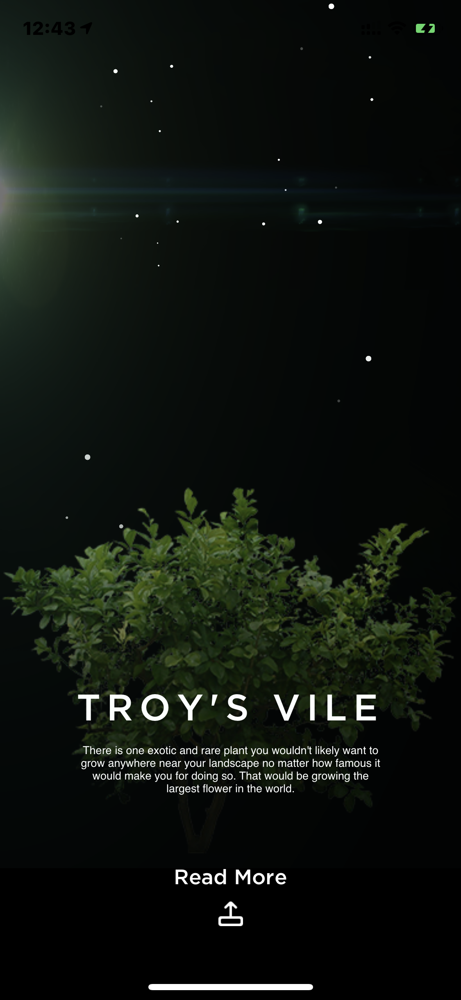

# Roots - The Exploration Guide
## Introduction 

### Concept of the application
The repository consists of the iOS application we created during App-a-thon Hackathon 2018 organised by Apple Developer Group in Vellore Institute of Technology. We were given a hypothetical problem statement to create an application that will help the space astronauts who are colonising Mars to track the growth of plants on the surface of Mars under controlled environment. We have created a concept for the same to demonstrate the feasibility to create an application that can solve the problem statement of managing the fauna growth. 

### Conclusion
We bagged the third position in the hack out of several teams on campus competing. To make interaction much more realistic we added the feature of viewing the plants in Augmented Reality using ARKit framework provided by Apple.

## Application Preview

## Frameworks
- UIKit
- ARKit

